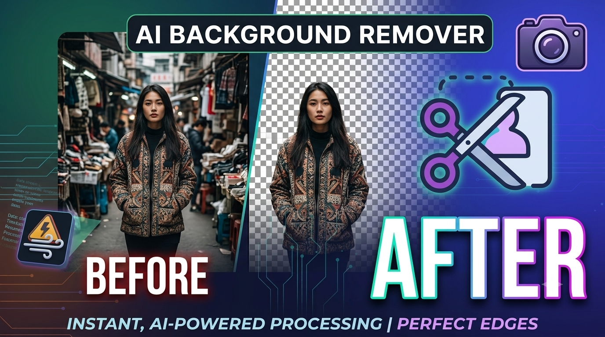

<div align="center">

# 👋 Hi, I'm Farhan Akthar

### 🚀 AI Engineer • Full Stack Developer • Machine Learning Enthusiast

<p align="center">
  <a href="YOUR_PORTFOLIO_LINK">
    
  </a>
  <a href="YOUR_LINKEDIN">
    
  </a>
  <a href="YOUR_GITHUB">
    
  </a>
</p>


</div>

---

# 🌟 About

A modern developer portfolio showcasing my work in **Artificial Intelligence**, **Machine Learning**, and **Full Stack Development**.

Designed with a premium UI inspired by modern SaaS products using **React**, **Vite**, **Tailwind CSS**, and **Framer Motion**.

---

# ✨ Features

- 🎨 Modern Glassmorphism UI
- ⚡ Lightning Fast (Vite)
- 📱 Fully Responsive
- 🎭 Smooth Animations
- 💼 Project Showcase
- 📄 Resume Download
- 📬 Contact Section
- 🌙 Dark Theme
- 🚀 SEO Friendly

---

# 🛠 Tech Stack

### Frontend

<p>

</p>

### Backend

<p>

</p>

### AI / ML

<p>

</p>

### Tools

<p>

</p>

---

# 🚀 Featured Projects

## 🤖 AI Resume Analyzer

AI-powered Resume & Job Description Matching System using NLP and TF-IDF to evaluate ATS compatibility and recommend improvements.

---

## 🖼 AI Background Remover

High-quality AI-powered image background remover with transparent PNG export.

---

## 🌦 Weather Dashboard

Real-time weather application featuring forecasts, air quality monitoring, and interactive weather insights.

---

## 📄 Text Analyzer

OCR-based application that extracts text from images and converts it into speech.

---

# 📸 Preview

> Replace this image with your portfolio screenshot.

```text
/public/assets/bg.png
```

or

```md

```

---

# ⚙ Installation

```bash
git clone https://github.com/YOUR_USERNAME/farhan-akthar-portfolio.git

cd farhan-akthar-portfolio

npm install

npm run dev
```

---

# 📦 Build

```bash
npm run build
```

---

# 🌐 Live Demo

### 🔗 Portfolio

https://YOUR-NETLIFY-LINK.netlify.app

---

# 📈 GitHub Stats

<p align="center">


</p>

---

# 🏆 Most Used Languages

<p align="center">


</p>

---

# 📫 Connect With Me

<p align="center">

<a href="YOUR_LINKEDIN">

</a>

<a href="mailto:YOUR_EMAIL">

</a>

<a href="YOUR_GITHUB">

</a>

<a href="YOUR_PORTFOLIO_LINK">

</a>

</p>

---

<div align="center">

### ⭐ If you like this project, consider giving it a star!

Made with ❤️ by **Farhan Akthar**

</div>
